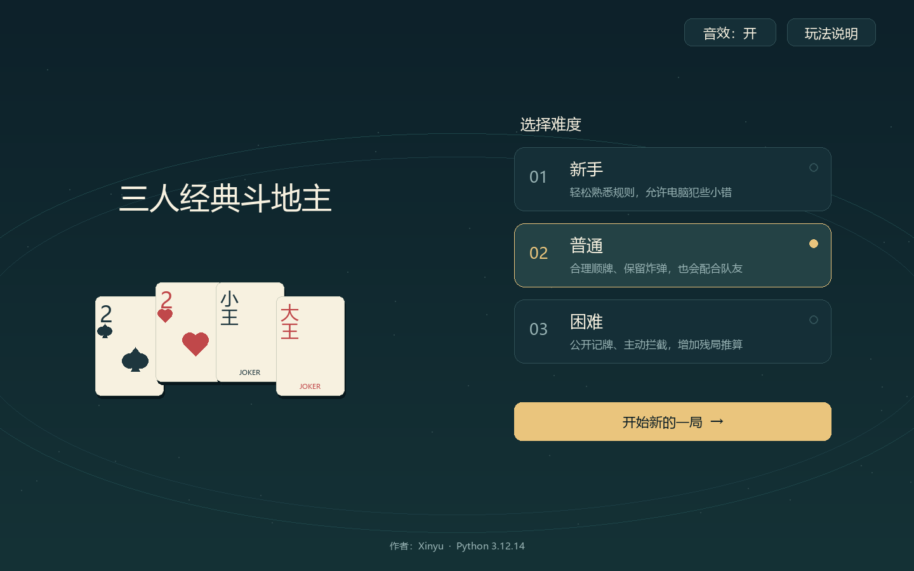
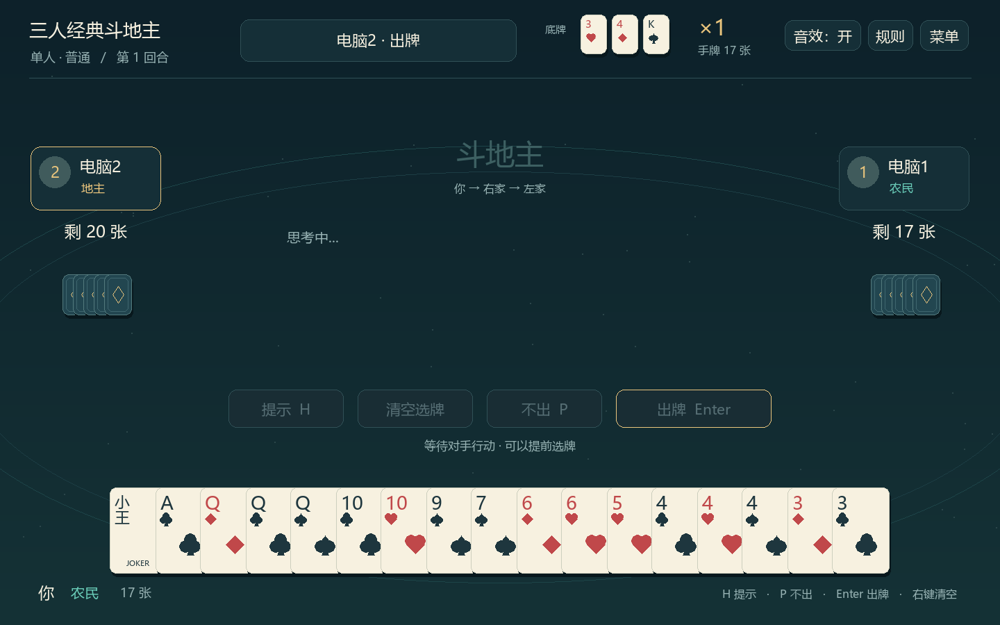

# 三人经典斗地主

一款使用 **Python + pygame-ce** 编写的单人桌面斗地主小游戏。你将与两位电脑玩家同桌对战，体验叫地主、抢地主、出牌与队友配合。

**作者：Tonny陳 · 当前版本：1.1 · Python 3.10+**



## 功能

- **经典三人玩法**：54 张牌，每家 17 张，3 张底牌，完整叫抢地主流程。
- **三档难度**：新手、普通、困难，采用不同的顺牌、拆牌和残局策略。
- **牌型校验**：支持单张、对子、三带一、顺子、连对、飞机、四带二、炸弹、王炸等。
- **点选与提示**：选中手牌上浮，支持取消、清空及连续切换提示组合。
- **声音与动画**：选牌和按钮点击音效，炸弹／王炸提示与震屏效果，可一键静音。
- **完整结算**：地主／农民胜负、倍数、春天与反春天，空格键再来一局。
- **窗口适配**：等比缩放，支持调整窗口大小；安装依赖后可离线游玩。

<details>
<summary>查看牌桌界面</summary>



</details>

## 快速开始

### 环境

- Python **3.10 或更高版本**，已在 Windows + Python 3.12 下验证。
- 依赖：`pygame-ce==2.5.8`。
- 中文字体：Windows 默认使用系统微软雅黑；其他系统请参见下方的字体说明。

### 安装与运行

下载整个仓库并解压，在包含 `main.py` 的项目根目录打开终端，执行：

```bash
python -m pip install -r requirements.txt
python main.py
```

以后启动只需执行 `python main.py`。Windows 如果使用 `py` 启动器，可将上述命令中的 `python` 换成 `py`。

> 请保留完整的项目文件，不能只复制 `main.py`。安装包名是 `pygame-ce`，代码中的导入名仍然是 `pygame`。

<details>
<summary>使用独立虚拟环境（Windows）</summary>

如果已有 Python 环境中安装了其他版本的 pygame，可以为本项目创建独立环境：

```powershell
python -m venv .venv
.\.venv\Scripts\python.exe -m pip install -r requirements.txt
.\.venv\Scripts\python.exe main.py
```

</details>

## 操作

选择难度后点击“开始新的一局”。你位于牌桌下方，右侧为**电脑1**，左侧为**电脑2**；地主优先出牌，此后按 **你 → 电脑1 → 电脑2** 的逆时针方向轮流行动。

| 操作 | 鼠标 / 快捷键 |
| --- | --- |
| 选牌、取消选牌 | 左键点击手牌 |
| 出牌 | “出牌”按钮 / `Enter` |
| 不出 | “不出”按钮 / `P` |
| 提示、切换下一组 | “提示”按钮 / `H` |
| 清空选牌 | “清空选牌”按钮 / 鼠标右键 |
| 查看规则 | 右上角“规则” |
| 返回菜单、继续当前局 | “菜单” / `Esc`；菜单内可点击“继续当前对局” |
| 关闭规则弹窗 | “返回” / `Esc` |
| 结算后再来一局 | “再来一局” / `Space` |
| 开关音效 | 右上角“音效：开 / 关” |

提示只会选中牌，不会自动出牌；没有能压过的牌时会给出提示。本轮首出不能“不出”。进入菜单或规则页面时，电脑暂不执行下一步。

推荐窗口至少为 **1000 × 625**。关闭程序会结束当前对局，游戏暂不保存进度。

## 规则说明

采用无癞子的三人斗地主规则：

- 三家都不叫地主时重新发牌；每次抢地主、炸弹、王炸均使倍数翻倍。
- 连续两家不出后，由最后成功出牌者重新领出。
- 顺子、连对和飞机主体均不能含 2 或王。
- 任一农民出完，农民队共同获胜；支持春天与反春天结算。

不同平台的叫抢和带牌细节有所差异，本项目的具体约定见 **[完整规则](docs/RULES.md)**，游戏内也可随时查看规则。

## 电脑策略

| 难度 | 策略特点 |
| --- | --- |
| 新手 | 带有随机失误，可能放过能压过的牌、拆开炸弹，不做残局搜索 |
| 普通 | 利用公开出牌信息整理手牌，减少拆炸弹，考虑队友与报单拦截 |
| 困难 | 加强剩余牌分析与拦截；小手牌估计出完手数，残局抽样搜索 |

AI **只接收自己的手牌与公开信息**，不会读取其他玩家的隐藏手牌。全桌剩余不超过 12 张时，困难档会对未知牌分布抽样，并进行有节点和时间预算的对抗搜索；它可能错过更优路线，不保证每个残局都能求得最优解。

AI 和提示在后台计算，界面可以继续响应操作。提示不会改变洗牌随机数。

## 项目结构

```text
.
├── main.py               启动入口与日志
├── app.py                牌桌绘制、交互、窗口适配与动画
├── core.py               发牌、牌型、合法性、叫抢与结算
├── ai.py                 三档 AI、残局推算与提示
├── sound.py              生成和播放点击音效
├── requirements.txt      依赖版本
├── tests/                规则、界面和音效回归测试
├── tools/
│   └── soak.py           完整自动对局测试
├── docs/
│   ├── RULES.md          详细规则
│   └── screenshots/      首页与牌桌截图
├── 验证记录.md            测试范围和结果
└── README.md
```

音效在启动时直接生成，无需额外音频素材。中文字体使用本机字体，仓库不包含系统字体文件。

## 测试

在项目根目录执行：

```bash
python -m unittest discover -s tests -v
python tools/soak.py --games 300
```

第二条命令为每档难度各运行 300 局，共 900 局。

当前验证包括 **20 项自动回归测试**。1.0 版规则与 AI 曾完成 **900 局模拟对战、40,205 次出牌或不出**，1.1 版未改动其算法。界面和音效测试使用 SDL 模拟设备；详细范围见 [验证记录](验证记录.md)。

## 常见问题

**提示 `No module named pygame`？**

请在运行游戏的同一个 Python 环境中执行 `python -m pip install -r requirements.txt`。若使用虚拟环境，安装和启动都应使用该环境里的 Python。

**找不到中文字体？**

Windows 默认使用微软雅黑。其他系统会尝试苹方、Noto Sans CJK 等字体；也可将可用的中文字体放到 `assets/font.ttf`，或通过 `DDZ_FONT` 环境变量指定字体路径。macOS / Linux 尚未做实机验证。

**点击没有声音？**

先确认右上角为“音效：开”，并检查系统及 Python 应用音量。若显示“音效不可用”，说明音频设备初始化失败；游戏会继续以静音模式运行。音效开关在本次运行中生效，重启默认开启。

**运行报错或发现玩法问题？**

日志位于 `main.py` 同目录的 `三人经典斗地主.log`。提交 Issue 时，请尽量附上 Python 版本、操作系统、复现步骤，以及相关日志或截图，便于定位。

## 作者

**Tonny陳**
